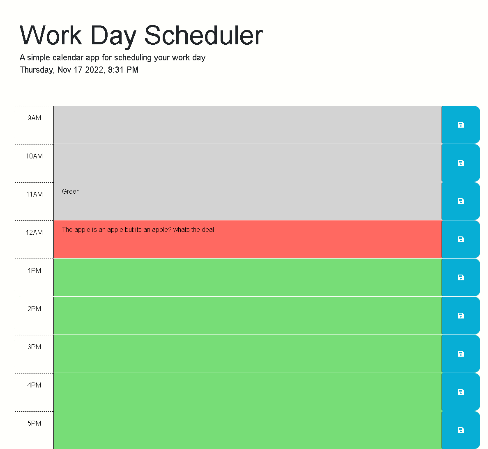

# Daily Planner

## Description

A daily planner that will hold user inputs until replaced. The current time and day is displayed as well.

- To assist in planning out your day
- This will allow you to store a single work days worth of activities

## Usage

Click on the following link to view the deployed page: [Daily Schedule](https://tooboi.github.io/Daily-Planner/)

## Credits and Technologies

- [jquery](https://jquery.com/)
- [w3schools](https://www.w3schools.com/)
- [mozilla](https://developer.mozilla.org/en-US/)
- [day.js](https://day.js.org/)

## License

- [MIT License](./LICENSE)
